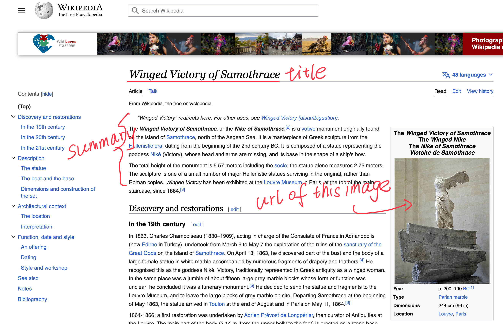

# Data Engineer Challenge

## Introduction

The goal of this challenge is to implement a wikipedia crawler, get the data then save the results to MariaDB.

This challenge should be finished within 3 hours with help from documentation and internet searches.

Completion of this task is only a part of the total assessment, and partial solutions are welcome.

We also take code clarity, architecture, your ability to learn, and your workflow into account, not only "does it run".

Refer to the Assessment Criteria section for more details.

To complete this challenge, you are expected to modify the files in `database/` and `crawler/`.
The `docker-compose.yml` file should not need any modifications.

`Git` should be used to make commits for your changes.

## WikiCrawler Implementation Details

The assignment reflects one of our data engineering daily work: developing and maintaining crawlers.
The business use case in this assignment is that we want to design a crawler to crawl the title, summary, and image url of certain wikipedia pages.

The first step of coding is to implement the `crawl` function of WikiCrawler.py. 
The `crawl` function should visit certain wikipedia pages from the crawling list and then extract the title, 
the summary (or first 150 words of the main content would also be accepted) and the image url (Just one image url is good enough if there is any. If there is no image, leave the field as NULL).
Please feel free to use any web crawling techniques that you prefer to use, for example, `requests`, `beautiful soup`, `scrapy` or `selenium`, etc.



After this is done (and as a separate git commit), we want to store these information in `wiki_articles` table by implementing the `save` function of WikiCrawler.py. 
The table should be expanded with fields `title`, `summary`, and `image_url`, you can achieve this via modifying the `init.sql.` under the database folder.

The data should be inserted into the mariadb instances's `wiki_articles` table using your python DB library of choice (such as `mariadb` which is already put in requirements.txt and Dockfile).


## Setup and Environment

1. [Install Docker](https://docs.docker.com/engine/install/) and [install Docker-Compose](https://docs.docker.com/compose/install/).

2. Initalize the `data-engineer-challenge-crawler` folder with git

3. The service can be run with **`docker-compose up --build`**, stopped with **`CTRL + C`** and taken down with **`docker-compose down`**.
To clean up any containers when done, you can use **`docker-compose rm`**.
The **`docker-compose rm`** command is useful when modifying the database schema, as mariadb only runs the scripts found in `database/` upon the first load from a clean environment.

The challenge is to use an Ubuntu 20.04 environment with python 3 to run the crawler.

For interacting with the SQL database, `python3-mysqldb` and `mariadb` works, as do any other packages you are comfortable using and can install in the environment.
Note that with mariadb, you need to commit the transaction once you are done inserting data

## Assessment Criteria

Here are the main criteria used for assessing this challenge, broken up into categories:

### Python

- Proper use of python logging, with helpful messages set to appropriate logging levels
- Structured code
- Error and Exception handling
- Helpful docstrings and/or type hints
- WikiCrawler is configurable via ENV VARs passed in via the docker-compose.yml file
- WikiCrawler is able to insert correct data into the `wiki_articles` table and commit them

### SQL

- Extended the provided schema in `database/init.sql` to add three new columns (`title`, `summary`, and `image_url`) to table `wiki_articles` for the crawled data

To examine the state of the mariadb tables (for both debugging and assessment), we can exec into the docker container by running the following commands:

```
docker exec -it data-engineer-challenge-crawler-mariadb-1 bash

mysql -u crawler -pa-insights

use crawler_dev;

SELECT * FROM `wiki_articles` LIMIT 10;
```

### Git

Here is a helpful guide: [Commit Message Guidelines](https://gist.github.com/robertpainsi/b632364184e70900af4ab688decf6f53)

- Short one-liner commit message on the first line
- Detailed description in the commit message body
- Use of amending or squashing to create final commit on the master branch
- Use of git feature branches or other git workflow
